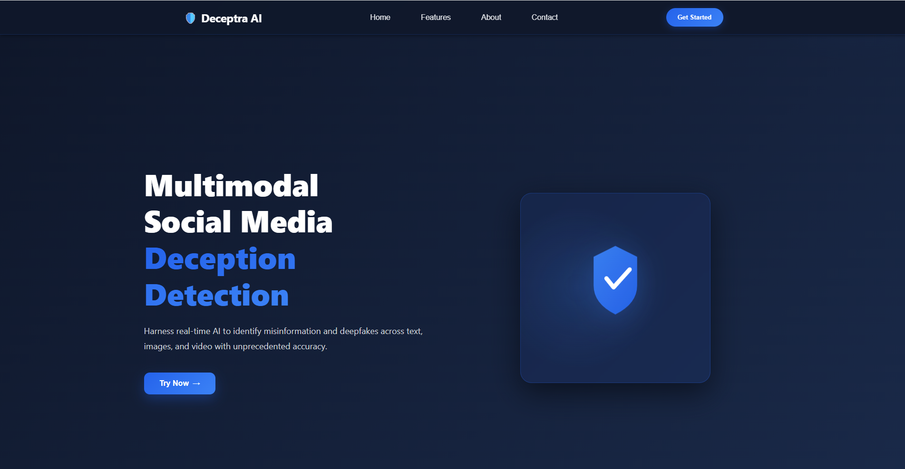
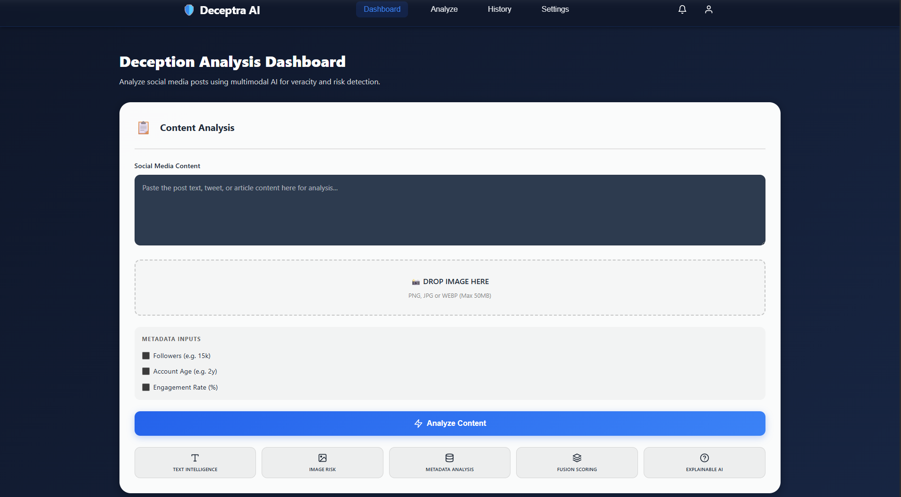
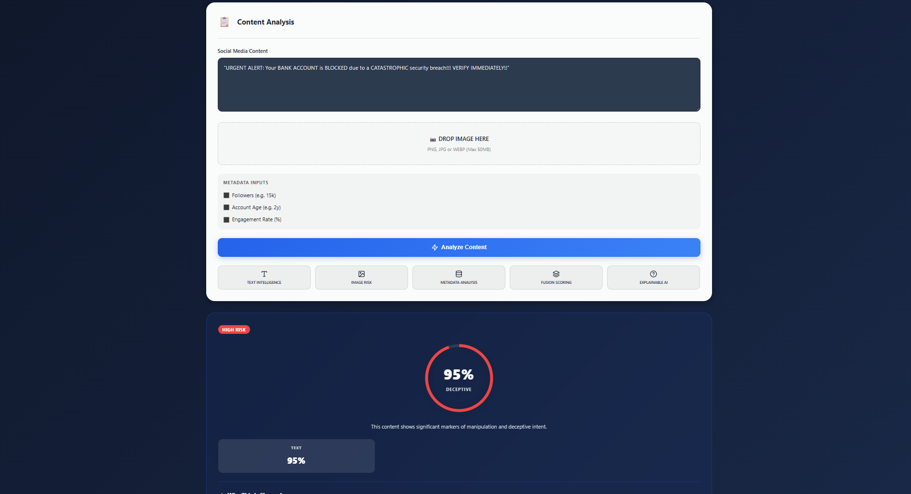
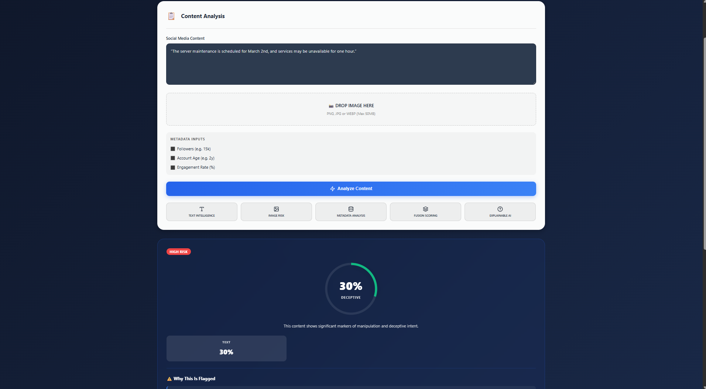
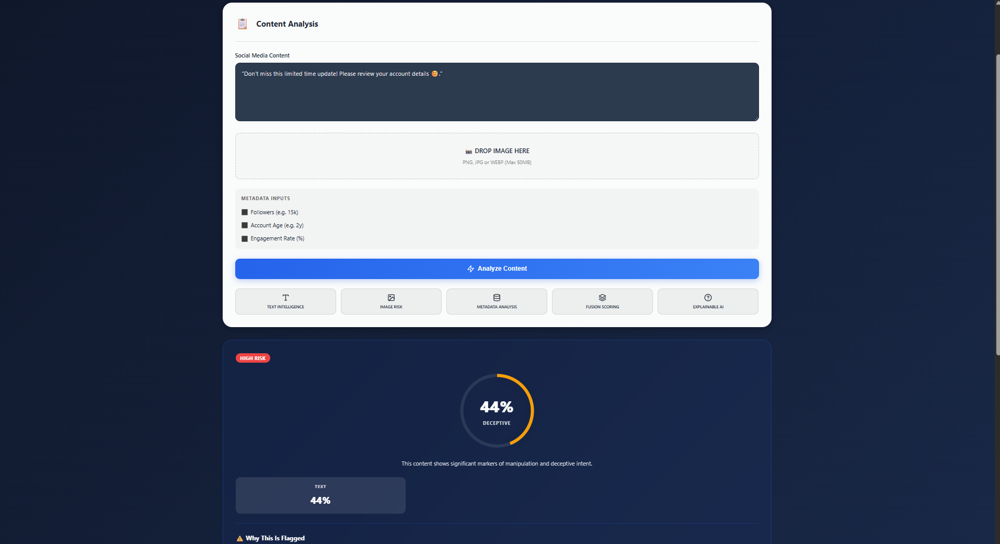

# 🛡️ Deceptra AI
### Multimodal Social Media Deception Detection System

Deceptra AI is an advanced multimodal system designed to detect deception, misinformation, and deepfake signals across social media content using AI-powered text and image analysis.

It combines NLP, computer vision, and fusion scoring to generate an explainable deception risk score.

---

## 🚀 Live Demo
(Coming Soon)

---

## ✨ Features

- 🧠 Text Intelligence (NLP-based deception detection)
- 🖼️ Image Risk Detection (Fake / Manipulated image analysis)
- 🔗 Multimodal Fusion Scoring
- 📊 Explainable Risk Score Dashboard
- 📁 Upload-based Content Analysis
- 📈 Confidence & Risk Visualization

---

## 🖥️ Application Screenshots


### 🏠 Landing Page


### ⭐ Core Features Section


### 📊 Dashboard – Content Analysis


### 🔴 High Risk Detection Example (95%)


### 🟢 Low Risk Example (30%)


### 🟡 Medium Risk Example (44%)


---

## 🧠 How It Works

1. User uploads text and/or image
2. Text model analyzes linguistic deception patterns
3. Image model detects fake/manipulated content
4. Fusion engine combines both signals
5. System outputs deception risk score with explanation

---

## 🏗️ Architecture
User Input (Text + Image)
↓
Text Analysis Model (BERT / NLP)
↓
Image Detection Model (ResNet / CNN)
↓
Fusion Layer
↓
Risk Scoring Engine
↓
Explainable Output Dashboard

---

## 🛠️ Tech Stack

**Frontend:**
- React.js
- Tailwind CSS
- Framer Motion

**Backend:**
- FastAPI
- PyTorch
- Transformers (BERT)

**ML Models:**
- ResNet-18 (Image Classification)
- BERT (Text Classification)
- Multimodal Fusion Layer

---

## 📦 Installation & Run

### 1️⃣ Clone repository

```bash
git clone https://github.com/your-username/deceptra-ai.git
cd multimodal-deception
```

### 2️⃣ Frontend (development)

From the project root:

```bash
npm install
npm run dev
```

If you prefer to work in the `src/` directory directly:

```bash
cd src
npm install
npm run dev
```

### 3️⃣ Backend (Python)

Create a virtual environment, install dependencies, and start the API server:

```bash
cd Backend
python -m venv .venv
.\.venv\Scripts\Activate.ps1   # PowerShell
# or: .\.venv\Scripts\activate  # cmd.exe
pip install -r requirements.txt
python app.py
```

### 4️⃣ Run tests / detector harness

From the `Backend` folder run the included test harness:

```bash
python test_categorized.py
```

---

## 🧾 Contributing

Contributions are welcome. To propose changes:

- Fork the repository
- Create a feature branch
- Open a pull request describing your change

Please follow existing code style and add tests for new logic.

---

## 📜 License

Add your project's license here (e.g., MIT). To include a license, add a `LICENSE` file at the repo root.

---

If images appear broken on GitHub, ensure `src/assets/*.png` files are committed and pushed — the README references `src/assets/` paths.
